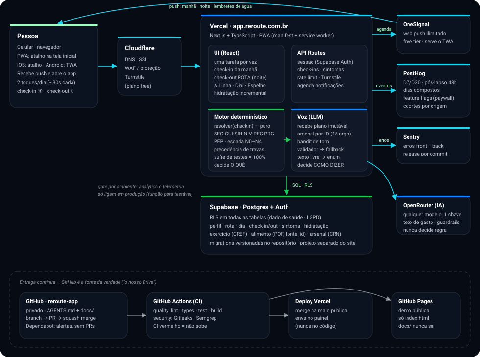

# REROUTE — Arquitetura Técnica do App MVP

> Proposta de arquitetura para o aplicativo REROUTE (web-first/PWA). Harness-agnostic: serve de guia para qualquer agente de IA ou pessoa desenvolvedora.

## Visão geral



O desenho tem duas camadas: **runtime** (a pessoa → Cloudflare → app na Vercel → Supabase e serviços) e **entrega contínua** (GitHub → CI → deploy). A separação Motor/Voz dentro da Vercel é a regra mais importante do produto: o motor decide *o quê*, o LLM decide *como dizer*.

## Decisões e justificativas

### 1. Web-first (PWA), não app nativo
Decisão do kick-off. A pessoa acessa `app.reroute.com.br`, adiciona atalho na tela inicial e recebe notificações — sem loja, sem aprovação, testável no boca a boca desde o primeiro dia. O Android (TWA — o mesmo PWA empacotado, US$ 25 taxa única) entra **depois** que o beta web validar a experiência. iOS continua via atalho (Apple: US$ 99/ano + 30% de comissão em compras no app — regra a reconfirmar).

### 2. Next.js + TypeScript
- O protótipo local do Ednei já era Next.js — o Codex tem contexto e fluência total no framework.
- Deploy nativo na Vercel (infra que já usam, plano Hobby).
- TypeScript `strict` desde o início: erros aparecem no editor/CI, não em produção.

### 3. Supabase (Postgres + Auth + RLS)
Já é a base da landing e do portal — reduzir número de fornecedores é decisão consciente.
- **Auth**: e-mail/senha ou magic link.
- **RLS (Row Level Security) desde a primeira tabela**: cada pessoa só lê os próprios dados. Dado de saúde é sensível (LGPD) — a trava fica no banco, não só no código.
- Migrations versionadas no repositório (`supabase/migrations/`), nunca alteração manual no painel.

### 4. Motor de rota: código determinístico, isolado e puro
**"O motor é o produto; o LLM é a voz."** O recálculo de rota é um módulo TypeScript **puro** (sem banco, sem rede), com suíte de testes escrita **antes** de qualquer prompt:

- Regras com fonte citável (E1–E6 da camada de exercício): força 2–3×/semana é piso; volume antes de intensidade; repetição antes de dificuldade; **toda sessão tem versão mínima** (náusea/sono ruim degradam para ~5 min, nunca para zero); cuidados GLP-1 (hidratação, hipoglicemia, tontura); sem corrida no MVP.
- Precedência de fontes: trava de segurança > modo cuidado > diretriz profissional validada > preferência da pessoa > padrão do app.
- Entrada: estado do dia (check-in/check-out, sintomas). Saída: plano do dia seguinte + explicação do porquê.

### 5. LLM apenas como camada de comunicação — via OpenRouter
O tom de "amigo virtual" (decisão do Ednei) é gerado por LLM **sobre** a saída do motor: recebe o plano já calculado e o transforma em mensagem acolhedora. Atrás de uma interface própria (`lib/voz/`) para trocar de modelo sem tocar no produto.

**Toda chamada de IA sai pelo OpenRouter** (gateway de IA — decisão de 04/08/2026):
- **Um endpoint, qualquer modelo** — trocar de modelo (ou usar modelos diferentes por tarefa: transcrição, interpretação, redação) é configuração, não refactor.
- **Teto de gasto no painel** — crédito pré-pago com limite; sem surpresa de fatura.
- **Guardrails e observabilidade de IA num lugar só** — logs de chamadas, custo por requisição, políticas por chave.
- **Fallback de provedor** — se um modelo/provedor cair, roteia para outro sem deploy.

**Contrato de execução** (da concepção — este é o desenho a implementar na Etapa 04):

```js
const plano = motor.resolver(checkin);        // determinístico, testado, imutável
const args  = arsenal.elegiveis(plano, hist); // só argumentos com ID revisado
const tom   = bandit.escolher(perfil, hist);  // 'dado' | 'espelho' | 'nenhum'
const msg   = await llm({
  plano_imutavel: plano,
  argumentos_permitidos: args,   // só pode citar destes, por id
  tom, historia: memoria.padroes,
  regras: [
    'Nunca gere número ausente de argumentos_permitidos',
    'Nunca contradiga plano_imutavel',
    'Lapso é evento, nunca identidade',
    'Se modo_cuidado, nenhuma meta numérica na mensagem'
  ]
});
if (!validar(msg, plano, args)) return plano.texto_fallback; // determinístico
```

**Proibido ao LLM:** gerar número, dose ou meta; citar estatística fora do arsenal (só por `arg_id`); ter voz na regra de alarme clínico (`SEG-01` — única camada onde nem a redação é dele).

> O mapa completo de **o que é IA × o que é algoritmo no MVP** — e a pergunta aberta de como comunicar esse limiar no produto — está em `09-perguntas-abertas.md` (pergunta nº 1).

### 6. Notificações: web push via OneSignal
Validado na call: free tier com push ilimitado, mesma integração serve web e app futuro, e a mesma ferramenta dispara campanhas para a base. WhatsApp descartado como canal recorrente (R$ 0,35/msg ≈ R$ 10,50/mês por pessoa — inviável com assinatura de R$ 8).

### 7. Dados: modelo inicial

| Tabela | Conteúdo |
|---|---|
| `perfil` | altura, peso, objetivo, relação com medicação, medicamento, nível declarado |
| `rota` | meta ativa, etapa atual (~2 kg por etapa), estado |
| `dia` | plano do dia, tarefas geradas, versão (planejada/mínima) |
| `checkin` / `checkout` | respostas da manhã e da noite, modalidade (clique/áudio) |
| `sintoma` | tipo, intensidade, dia — alimenta o recálculo |
| `hidratacao` | marcação incremental (500ml por toque) |
| `exercicio` | catálogo curado (~20), com `revisado_por` (CREF), `taxonomia_ref`, `regride_para`/`progride_para` |
| `alimento` | tabela canônica da POF/IBGE com `fonte_id` por linha; classificação PEP (âncora/complemento/não-âncora) |
| `arsenal` | os 18 argumentos citáveis por ID (`INI-01`…`SAI-03`), com fonte, ressalva e `revisado_por` (CRN) |

Progressão de exercício mora **nos dados**, não no código (`regride_para`/`progride_para`). O motor expõe funções puras como `resolver(checkin)` e `porcoes(peso, fator)` — as fórmulas do PEP (`g_por_PEP = 2500/prot_100g`, `peps = max(3, round(peso*fator/25))`) já estão especificadas e simuladas na concepção.

> 🔮 **Preparação barata para o futuro:** quando a camada de exames entrar (pós-MVP), carimbar **LOINC** em cada marcador desde a primeira migration (custa uma coluna) — alinha o vocabulário com a RNDS/FHIR e transforma futura parceria com laboratório em integração, não tradução.

### 8. Repositórios (decisão do kick-off: separar)

| Repo | Conteúdo | Deploy |
|---|---|---|
| `edneictba/reroute-site` | Landing + portal do investidor (existente) | Vercel (2 projetos) |
| `rnatto-gempe/reroute-app` | O aplicativo (privado; criado em 04/08/2026 com protótipo de UI + documentação) | Demo: GitHub Pages · App: Vercel (`app.reroute.com.br`) quando o esqueleto entrar |

### 9. Observabilidade e analytics (detalhes em `05-setup-infraestrutura.md`)
- **PostHog** — analytics de produto: funil de onboarding, retenção D7/D30, recuperação pós-lapso, dias compostos. Open source, free tier generoso, session replay incluído.
- **Sentry** — erros de frontend e backend com stack trace.
- **Gate de ambiente**: analytics só liga em produção (função pura testável decide `enabled`); dev e testes nunca enviam dados.

### 10. Segurança (mínimo do MVP)
- RLS em todas as tabelas; service role key só no servidor.
- Segredos em variáveis de ambiente (Vercel/GitHub Secrets); `.env.example` versionado, `.env` nunca.
- Cloudflare Turnstile nos formulários públicos (o site já usa).
- Rate limiting nas rotas de API públicas (padrão já existente no `reroute-site`).
- CI com detecção de segredos (Gitleaks) e SAST (Semgrep) — ver `04-boas-praticas.md`.
- Escalonamento de emergência: sintoma grave → orientar procurar atendimento (SAMU 192), sem diagnóstico.

## O que fica explicitamente para depois

| Item | Gatilho para entrar |
|---|---|
| App Android (TWA na Play Store) | Beta web validado |
| Camada de exames (travas por marcador) | Pós-MVP; spec em `referencias/sugestoes-iniciais/` |
| Áudio da nutricionista (HITL duplo) | Depende de jurídico + camada de exames |
| Foto de refeição | Precisão da IA ainda insuficiente (teste periódico) |
| Wearables / Apple Watch | Tração do MVP |
| Self-hosting de analytics | Volume que justifique sair dos free tiers |
